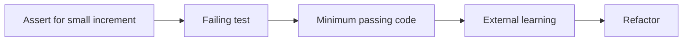

# Monitoring against overheating

Rechargeable batteries can heat during charging and discharging. Different thermal management techniques are used based on their capacity and performance.

This project aims to implement automated monitoring and alerting when the thermal management fails.

## Technical domain

There are [three types](https://www.batterydesign.net/battery-thermal-management/) of battery-cooling systems with examples:

- Active: Using air or liquid
- Passive: Ventilation
- Hybrid: Fan with ventilation

Of course, cooling systems can fail. Hence we need a system to sense the battery temperature and take action when thresholds are breached.

## Thresholds

Thresholds depend on the type of cooling system. A battery with active cooling may be allowed to fluctuate more. E.g., it can be allowed to charge faster even when its temperature is high.

Here is a table of thresholds

| Cooling Type | Warning (°C) | Alert (°C) |
|--------------|--------------|------------|
| Active       | 45           | 55         |
| Passive      | 35           | 40         |
| Hybrid       | 38           | 50         |

## Actions

Actions are of different types, based on customer capability:

- Trigger an actuator (e.g., to restrict the charging rate)
- Alert a human via email

## The task

Though the effectiveness of the system depends on many factors (sensors, email-providers), focus the delivery on the above requirements. Define interfaces to talk to external systems.

However, like in any project, there are dependencies and everything isn't known upfront. So define the interfaces in stages.

- Initially, we have one type to work with - batteries with passive cooling.
- During the project, we get other types (active and hybrid), but the action to take at "warning" level is unclear.
- Next we have the email alert, but the controller interface is unclear.

There are different ways to handle incremental interface specifications. One way is to define a very generic interface to start, with pluggable behavior. However, this requires many assumptions to be made, especially about non-happy flows. Instead, we will follow the Test-driven method in this project.

## Deliverables

Work towards the deliverables in short steps. Ensure quality gates pass at each step.

| Step | Objective | Deliverable |
|------|-----------|-------------|
| 1 | Quality gates | GitHub actions with quality criteria |
| 2 | Data boundary | Express external interface as a test (passive-cooling with email alert) |
| 3 | Pass the test and the quality gates | Implementation as per the interface |
| 4 | Add active-cooling type | Test and implement new thresholds |
| 5 | Refactor: Reduce duplication | Separation of classification from emailing |
| 6 | Add actuator | Test and implement new action |

## Workflow

